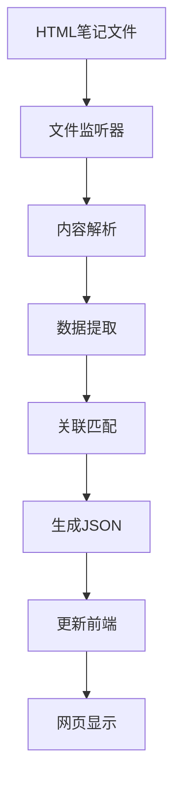

# 📚 大学生活平台 - 功能总结

## 🎯 项目概述

一个全面的大学生活管理平台，包含学习笔记和视频分析等模块，支持**动态扫描**、**自动更新**和**移动端优化**。基于GitHub Pages构建，无需服务器即可运行。

## ✨ 核心功能

### 📝 大学生活记录
- ✅ **内容管理**：记录大学生活的点滴
- ✅ **模块化架构**：支持多种功能模块整合
- ✅ **数据统计**：提供各模块数据汇总
- ✅ **灵活扩展**：可根据需求添加新模块

### 📺 视频分析模块
- ✅ **内容评分**：对视频内容进行分析和评分
- ✅ **奖金计算**：根据评分自动计算奖金
- ✅ **分析员绩效**：对比分析员的工作表现
- ✅ **数据可视化**：直观展示分析结果

### 🔄 动态内容扫描
- ✅ **自动扫描**：扫描hjf和hjm目录下的HTML文件
- ✅ **智能关联**：按照`文件名-review.html`规则自动关联评分报告
- ✅ **实时监听**：文件变化时自动更新数据
- ✅ **内容提取**：自动提取标题、预览内容和元数据

### 📱 移动端优化
- ✅ **响应式设计**：完美适配手机、平板、桌面
- ✅ **移动菜单**：汉堡包菜单，触摸友好
- ✅ **PWA支持**：可安装为手机App
- ✅ **离线访问**：Service Worker缓存支持

### 🎨 用户界面
- ✅ **现代化设计**：渐变色、卡片式布局
- ✅ **评分关联**：笔记与评分报告无缝集成
- ✅ **视觉标识**：有评分的笔记特殊标记
- ✅ **深色模式**：自动适配系统主题

## 🛠️ 技术架构

### 前端技术栈
```
HTML5 + CSS3 + Vanilla JavaScript
├── 响应式布局 (CSS Grid + Flexbox)
├── 现代CSS特性 (Custom Properties, CSS动画)
├── PWA技术 (Service Worker + Web App Manifest)
└── 原生JavaScript (ES6+, 模块化)
```

### 自动化工具
```
Node.js脚本生态
├── 文件监听 (chokidar)
├── 内容解析 (HTML解析)
├── 数据生成 (JSON格式)
└── 开发服务器 (serve)
```

### 项目结构
```
GithubPage/
├── 📄 index.html              # 主页
├── 📋 manifest.json          # PWA配置
├── ⚙️ sw.js                  # Service Worker
├── 📦 assets/                # 静态资源
│   ├── css/                  # 样式文件
│   ├── js/                   # JavaScript文件
│   └── icons/                # PWA图标
├── 📁 2025/                  # 笔记目录
│   ├── hjf/                  # HJF笔记
│   └── hjm/                  # HJM笔记
├── 🔧 scripts/               # 自动化脚本
│   ├── scan-notes.js         # 主扫描脚本
│   ├── frontend-scanner.js   # 前端扫描器
│   ├── demo.js               # 演示脚本
│   └── README.md            # 脚本说明
└── 📚 文档文件               # 说明文档
```

## 🚀 使用流程

### 开发流程

1. **启动监听**
   ```bash
   npm run watch
   ```

2. **添加笔记**
   ```bash
   # 手动创建或使用演示
   npm run demo:create
   ```

3. **自动更新**
   - 脚本检测文件变化
   - 自动提取内容
   - 更新数据文件
   - 刷新页面查看

### 部署流程

1. **构建数据**
   ```bash
   npm run build
   ```

2. **提交代码**
   ```bash
   git add .
   git commit -m "更新笔记"
   git push
   ```

3. **自动部署**
   - GitHub Pages自动构建
   - 网站实时更新

## 📊 数据流程



### 关联规则示例
```
✅ 正确关联:
   📝 1-Jun.html          ←→ 📊 1-Jun-review.html
   📝 23-6月.html        ←→ 📊 23-6月-review.html

❌ 无法关联:
   📝 note.html          ✗  📊 different-review.html
```

## 💡 智能功能

### 自动内容提取
```javascript
// 优先级顺序
1. <title>标签内容
2. <h1>标签内容  
3. 文件名转换
```

### 预览生成
```javascript
// 处理流程
1. 移除HTML标签
2. 清理空白字符
3. 截取前150字符
4. 添加省略号
```

### 关联匹配
```javascript
// 匹配逻辑
笔记: example.html
评分: example-review.html
结果: 自动关联 ✅
```

## 📱 移动端特性

### 响应式断点
```css
/* 桌面端 */
@media (min-width: 769px)

/* 平板端 */
@media (max-width: 768px)

/* 手机端 */
@media (max-width: 480px)

/* 横屏适配 */
@media (orientation: landscape)
```

### 触摸优化
- 📏 **最小触摸目标**：44px × 44px
- 🎯 **手势友好**：滑动、点击反馈
- 📱 **状态栏适配**：安全区域支持

## 🎨 设计系统

### 颜色方案
```css
:root {
  --primary-color: #1a2980;    /* 主蓝色 */
  --secondary-color: #26d0ce;  /* 青色 */
  --accent-color: #667eea;     /* 紫色 */
}
```

### 组件库
- 📄 **笔记卡片**：内容展示 + 操作按钮
- 🏷️ **评分徽章**：视觉标识
- 🔘 **按钮系统**：主要/次要/评分按钮
- 📊 **统计卡片**：数据展示

## 🔄 扩展功能

### 当前支持
- ✅ 大学生活记录基础功能
- ✅ 视频分析模块（HJF和HJM两个分析员）
- ✅ 笔记和评分报告关联
- ✅ 自动扫描和更新
- ✅ 移动端优化

### 扩展可能
- 🔄 **更多生活模块**：学习计划、课程笔记等
- 🔄 **多作者支持**：添加新的作者目录
- 🔍 **搜索功能**：全文检索
- 🏷️ **标签系统**：分类管理
- 📈 **统计分析**：阅读数据

## 📈 性能优化

### 加载优化
- ⚡ **懒加载**：按需加载内容
- 💾 **缓存策略**：Service Worker缓存
- 📦 **资源压缩**：CSS/JS最小化

### 运行优化
- 🔄 **增量更新**：只更新变化的数据
- ⏱️ **防抖处理**：避免频繁更新
- 🎯 **精确监听**：只监听相关文件

## 🎉 使用场景

### 个人大学生活记录
- 📚 学习笔记记录
- 📊 学习进度跟踪
- 📺 视频内容分析
- 🏆 成果展示分享

### 团队协作
- 👥 多人笔记共享
- 📝 学习内容评估
- 📈 学习效果分析

### 知识建设
- 🌱 知识库构建
- 🔗 内容关联管理
- 📱 移动端访问

## 🏆 项目亮点

1. **🎯 零配置部署** - 推送即部署，无需服务器
2. **📱 完美移动适配** - 原生App体验
3. **🔄 智能自动化** - 文件监听 + 自动更新
4. **🎨 现代化设计** - 渐变色 + 卡片布局
5. **⚡ 高性能** - PWA + Service Worker
6. **🛠️ 高可扩展** - 模块化架构设计

---

## 📞 快速开始

```bash
# 1. 安装依赖
npm install

# 2. 创建演示笔记
npm run demo:create

# 3. 启动开发服务器
npm run dev

# 4. 开启文件监听
npm run watch
```

🎉 **项目部署完成！享受你的大学生活平台吧！** 