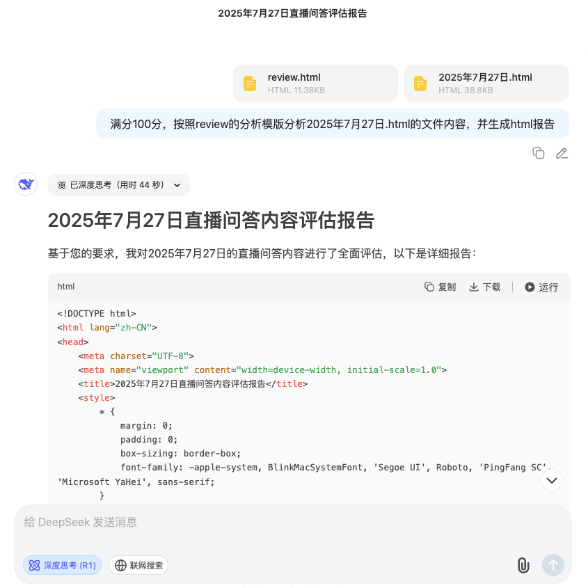

# 项目使用说明

如需更多信息，请查阅相关文档或视频教程。

## 一、开发环境准备 🔧

安装前端开发环境：

- 安装 Node.js 环境
- 安装 Git 工具，并配置用户名与邮箱：

```
git config --global user.name "hjf"  # 或 "hjm"
git config --global user.email "xxx@qq.com"
```

---

## 二、拉取项目源代码 📥

1. 克隆 GitLab 仓库：

```
git clone https://gitlab.com/new-info/new-info.gitlab.io.git
```
2. 进入项目目录：
```
cd new-info.gitlab.io.git
```

3. 拉取最新主分支代码：
```
git pull origin main
```
---

## 三、项目运行与构建 🚀

1. 安装项目依赖：

```
npm install
```
2. 启动开发模式：
```
npm run dev
```
3. 构建项目（生产模式）：
```
npm run build
```
---
## 四、文件与数据更新 📂

### 1. 上传借款凭证图片

图片存放路径如下（若无该文件夹，请新建）：

- vouchers/hjf
- vouchers/hjm

---

### 2. 上传 HTML 文件资源

将分析文件上传至以下路径：

- 2025/hjf
- 2025/hjm

文件命名规范：

- 原始分析文件：2025年8月3日.html
- 评分文件：2025年8月3日-review.html

评分文件需严格匹配对应日期，添加 `-review` 后缀。

---

### 3. 评分报告生成规则 ⚙️
> 满分100分， 按照review的分析模版分析2025年7月27日.html文件内容，并生成html报告
- 分析模板文件位于：assets/template/review.html

- 自行新增的视频分析文件（如 2025年7月27日.html）需重命名为标准日期格式。

- 分析完成后，新建 2025年7月27日-review.html 文件，并将 AI 生成内容粘贴至此文件中。

- 将以上新增文件放在`2025/hjm`或`2025/hjf`目录下

- 启动项目并强制刷新页面或清除缓存，以确保新增数据显示。

📌 示例图：  

### 4. 构建部署
数据更新完成后，执行构建命令以生成加密数据，适配生产部署：
```
npm run build
```
部署地址： 👉 https://new-info.github.io/

### 5. 提交至 GitLab 🚀
a. 创建新分支：
```
git checkout -b feat/hjf  # 或 feat/hjm
```
b. 提交改动：
```
git add .
git commit -m "feat: hjf评分更新"  # 或 "feat: hjm评分更新"
git push origin feat/hjf          # 或 feat/hjm
```
c. 在 GitLab 网页端提交合并请求，将分支合并到 main 分支（没有权限可以发给我合并链接审核合并）。

---
## 五、借款记录详情数据更新 📝
文件`assets/data/expenses-records.js`records数组里面手动新增一条记录
```js
records: [
    // 复制以下内容进行修改
    {
        id: 5, // 自增id,根据已有id手动新增
        date: '2025-09-01', // 借款日期
        borrower: 'hjf', // 借款人hjf,hjm
        amount: 1500, // 借款金额
        purpose: '生活费', // 借款目的
        returnDate: '-', // 归还日期
        status: 'pending', // 归还状态 returned（已归还）, pending（待归还）, overdue（逾期）
        actualReturnDate: '', // 实际归还日期
        notes: '', // 备注
        pinned: false, // 是否置顶（true 为置顶）
        voucher: null // 本地凭证文件名, vouchers/hjf下新增的文件名
    },
    // 复制结束
]
```
